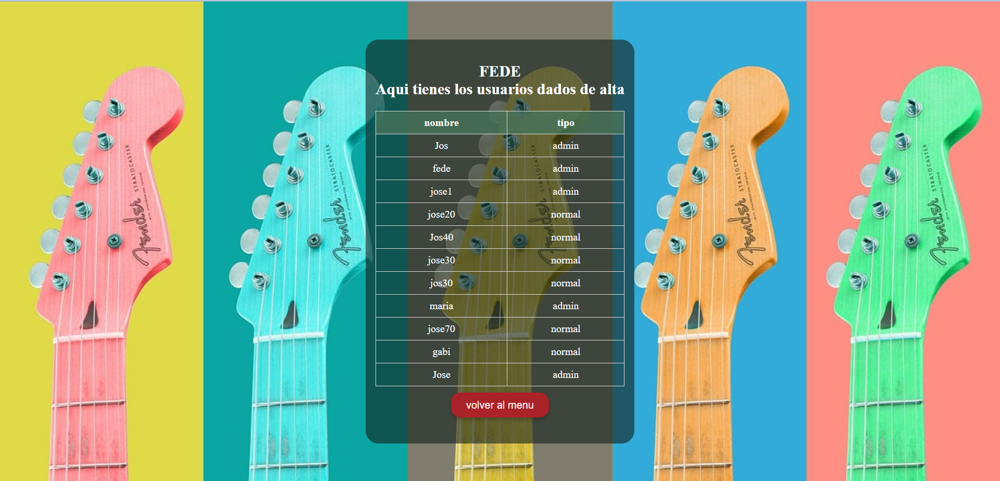
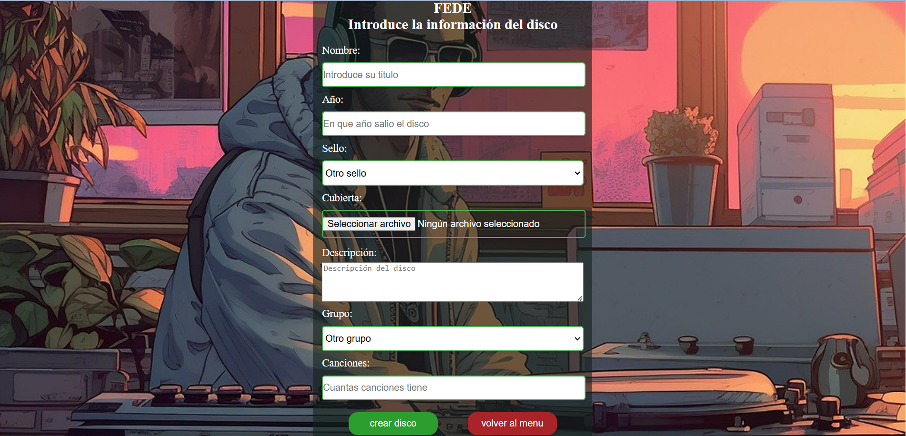
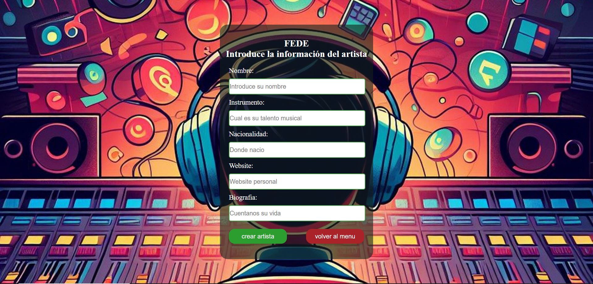
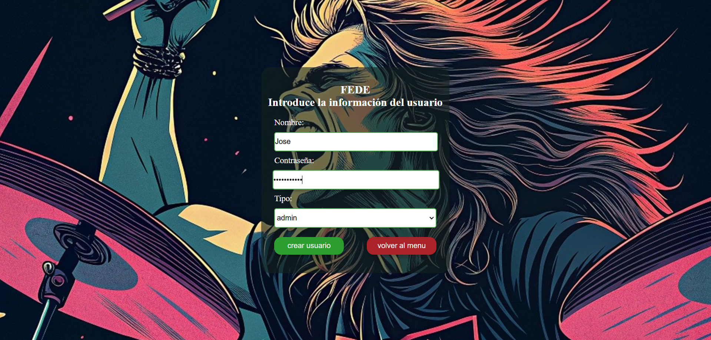
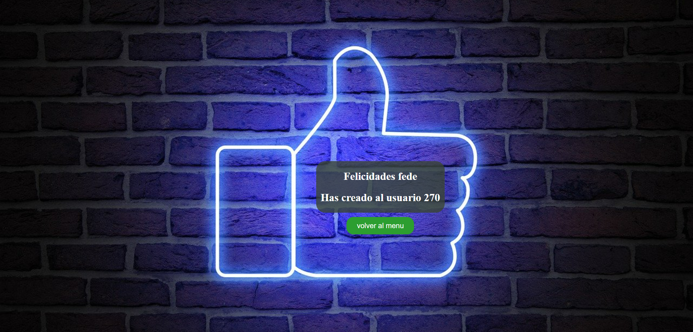
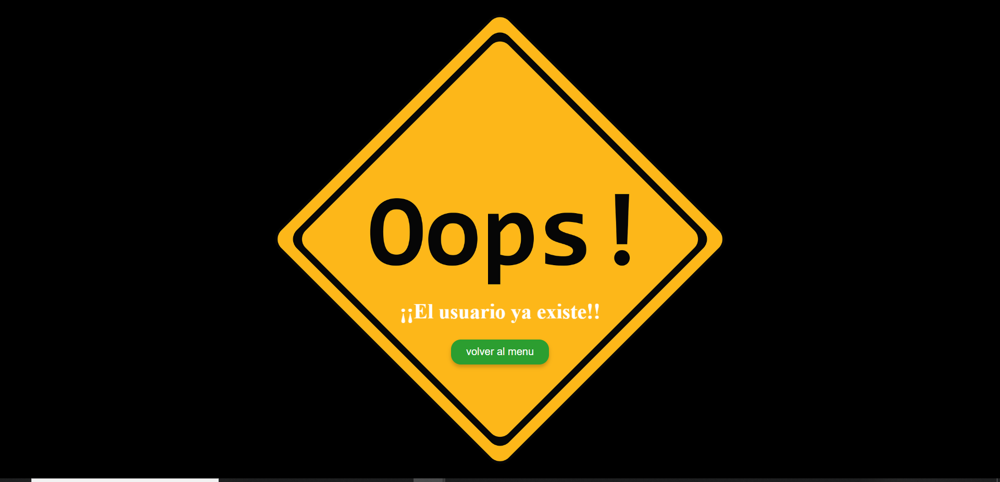
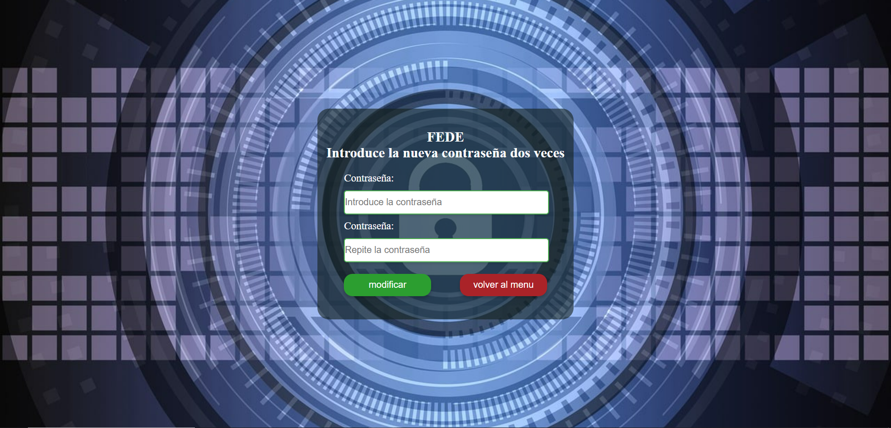
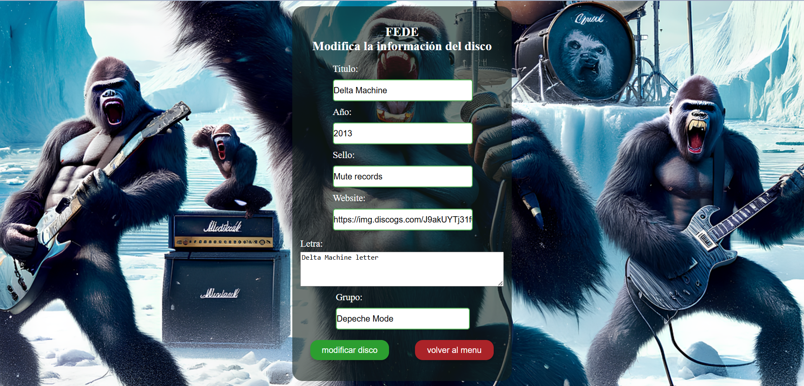
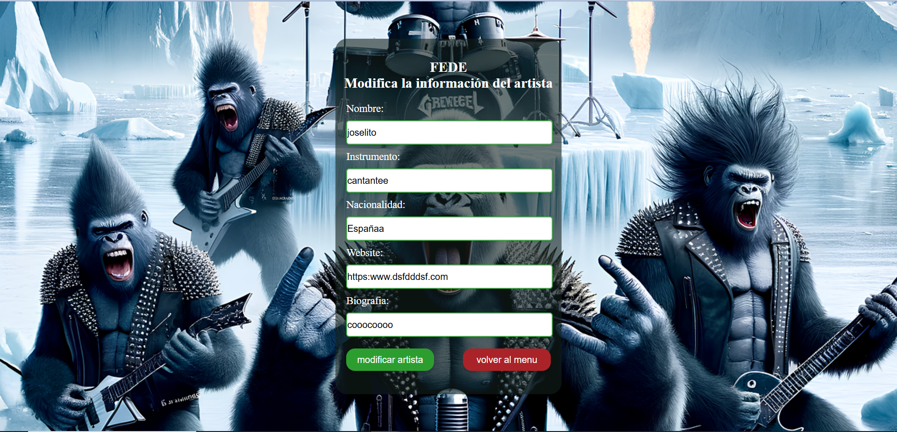
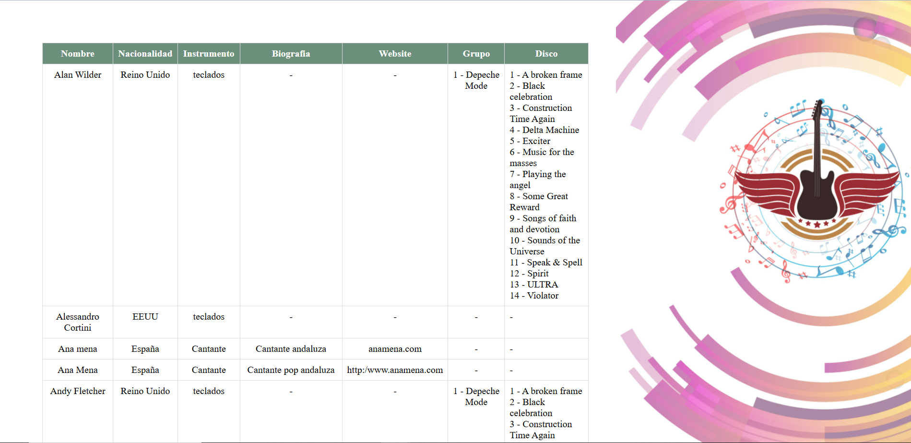

# Discografía - Proyecto DAW

## Descripción
Este es un proyecto desarrollado en **PHP** con **MySQL** y ejecutado en un entorno **XAMPP**. Se trata de una discografía en la que se pueden gestionar usuarios, discos, canciones, grupos y otros elementos relacionados. Permite agregar y eliminar información de forma sencilla.

Este trabajo ha sido realizado por **José Luis Martínez Climent** en el **2º curso de Desarrollo de Aplicaciones Web (DAW)** en **Castellón de la Plana** durante el año **2025**.

## Tecnologías utilizadas
- **PHP** (Backend)
- **MySQL** (Base de datos)
- **XAMPP** (Servidor local)
- **HTML, CSS y JavaScript** (Frontend básico)

## Requisitos
Para ejecutar este proyecto en tu entorno local, necesitas:
- Tener instalado **XAMPP**
- Contar con **PHP 7+**
- Tener configurada una base de datos **MySQL**

## Instalación y Configuración
1. Clona este repositorio en tu servidor local:
   ```sh
   git clone https://github.com/tu-usuario/tu-repositorio.git

2. Mueve la carpeta del proyecto a la carpeta htdocs de XAMPP.
3. Inicia el servidor Apache y MySQL desde el panel de control de XAMPP.
4. Importa la base de datos:  
    - **4.1** Abre phpMyAdmin en tu navegador (http://localhost/phpmyadmin).  
    - **4.2** Crea una nueva base de datos llamada `discografia`.  
    - **4.3** Importa el archivo `discografia.sql` que se encuentra en la carpeta del proyecto.  
1. Configura la conexión a la base de datos en config.php:

$host = 'localhost';
$user = 'root';
$password = '';
$dbname = 'discografia';

http://localhost/discografia

## Funcionalidades
✅ Agregar, editar y eliminar usuarios.
✅ Gestionar discos, canciones y grupos.
✅ Interfaz sencilla para la administración de la discografía.
✅ Conexión con MySQL mediante PHP y consultas preparadas.

Capturas de pantalla












## Autor
👨‍💻 José Luis Martínez Climent
📍 Castellón de la Plana, 2025

## Licencia
Este proyecto es de código abierto y puede ser utilizado con fines educativos o personales.
